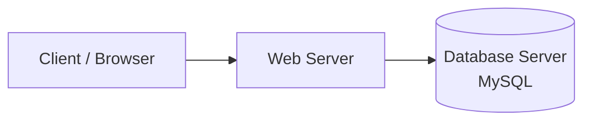
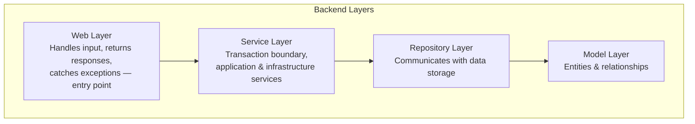

# 🌍 International Mobility Platform

### Web platform for managing international study mobility applications

Replaces a manual Google Forms process with an automated web platform for handling international study mobility offers, candidate applications, scoring, and results communication.

  
  
  
  

  
  
  

> **Team:** Souibgui Mohamed Amine & Zorgui Ramez
> **Supervisor:** M. Salah Bousbia — Directeur des relations extérieures, ESPRIT
> **Context:** Company immersion internship, ESPRIT

---

## 📋 Overview

ESPRIT's external relations department (direction des relations extérieures) used to manage international study mobility offers through a manual, Google Forms–based selection process — slow and labor-intensive as the number of offers and applicants grew.

This platform replaces that process with a dedicated web application offering two management modes:

- **Student side** — browse mobility offers and apply by filling out offer-specific forms. The platform automatically computes each applicant's score using a defined formula, producing a sorted, ranked list of candidates per offer.
- **Admin side** (external relations department) — review application results and communicate outcomes to candidates by email directly from the platform.

---

## ✨ Features

### 🎓 Student (Front-Office)
- Browse available international mobility offers
- Apply to an offer via a dedicated application form
- Automatic score calculation based on submitted data

### 🛠️ Admin (Back-Office)
- Login / authentication
- User management (view/register users)
- View sorted list of applications and candidate results per offer
- Manage mobility offers
- Send result emails directly to candidates from the platform

---

## 👥 Actors

| Actor | Role |
|:------|:-----|
| **Étudiant candidat** | Applies to international mobility offers through the platform |
| **Direction des relations extérieures (Admin)** | Reviews application results and communicates outcomes to candidates via email |

---

## 🏗️ Architecture

### Physical Architecture — 3-Tier

### Logical Architecture — Layered Backend + MVC Frontend

The frontend follows the **MVC (Model-View-Controller)** pattern, standard to Symfony, separating data (Model), presentation (View), and request handling (Controller).

---

## 🛠️ Tech Stack

| Layer | Technology |
|:------|:-----------|
| Backend Framework | **Symfony** (PHP) |
| Frontend | **HTML**, **CSS**, **JavaScript** |
| Database | **MySQL** |
| IDE | Visual Studio Code |
| Version Control | Git + GitHub |
| Methodology | Agile — **Scrum** |

---

## 📐 Non-Functional Requirements

- **Security** — access control via user/admin permission levels
- **Maintainability** — readable, commented code, organized by page/task
- **Usability (Ergonomie)** — designed to remain user-friendly across actors, balanced against response time
- **Reliability** — candidate scoring must be computed correctly and consistently from submitted data

---

## 📱 Screens

> 📸 *The internship report references the following screens — add screenshots here once available:*
> - Login page
> - Register page (back-office)
> - User list (back-office)
> - Applications list (back-office)
> - Offers list (back-office)
> - Application results list (back-office)
> - Send emails page (back-office)
> - Result email preview
> - Home page (front-office, student view)
> - About us page (front-office)
> - Offers page (front-office)
> - Application form (front-office)

---

## 📝 Notes

This project was built during a company immersion internship at **ESPRIT**'s external relations department, following the Scrum methodology in short iterative sprints. It was developed as a two-person team project.

---

*International Mobility Platform — ESPRIT Internship — 2024*

